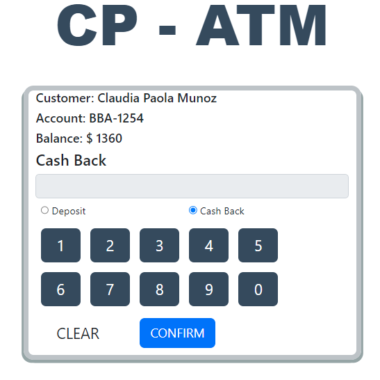

<div align="center" id="top"> 
    
</div>
<h1 align="center">ATM - Week 15</h1>

<p align="center">
  

  

  

  
</p>


<p align="center">
  <a href="#dart-about">About</a> &#xa0; | &#xa0; 
  <a href="#sparkles-features">Features</a> &#xa0; | &#xa0;
  <a href="#rocket-technologies">Technologies</a> &#xa0; | &#xa0;
  <a href="#white_check_mark-requirements">Requirements</a> &#xa0; | &#xa0;
  <a href="#checkered_flag-starting">Starting</a> &#xa0; | &#xa0;
  <a href="#memo-license">License</a> &#xa0; | &#xa0;
  <a href="#recycle-improvements">Improvements</a> &#xa0; | &#xa0;	
  <a href="https://github.com/cpmn" target="_blank">Author</a>
</p>

<br>

## :dart: About ##

This project was made during week 15 of MIT xPRO bootcamp. ATM simulator, Deposit and Cash Back in a user-friendly UI


## :sparkles: Features ##

:heavy_check_mark: As a user I would like to Deposit an amount of money to my bank account.\
:heavy_check_mark: As a user I would like to Withdraw an amount of money of my bank account.\
:heavy_check_mark: As a user I wont be able to Withdraw more than my balance.\
:heavy_check_mark: As a user I would like to see my balance after any transacction.\
:heavy_check_mark: As a user I would like to have a user friendly UI.\

## :rocket: Technologies ##

The following tools were used in this project:

- [React](https://en.reactjs.org/)
- [HTML](https://www.w3schools.com/html/)
- [CSS](https://www.w3schools.com/css/)
- [Babel](https://babeljs.io/)

## :white_check_mark: Requirements ##

Before starting : you need to have [Git](https://git-scm.com) and [Node](https://nodejs.org/en/) installed to clone de the project.

## :checkered_flag: Starting ##

```bash
# Clone this project
$ git clone https://github.com/cpmn/ATM

# Clone this project
$ git clone https://github.com/cpmn/ATM
# Access
$ cd ATM
# Configure npm server
$ npm install -- global http-server
#start the server
$ http-server -c-1

# Just Open the http://localhost:8080 on your browser
```

## :recycle: Improvements ##

It would be nice to have the next improvements:
- [ ] Pin identification number
- [ ] User details account

## :memo: License ##

This project is under license from MIT. For more details, see the [LICENSE](LICENSE.md) file.


Made with :heart: by <a href="https://github.com/cpmn" target="_blank">Claudia Muñoz</a>

&#xa0;

<a href="#top">Back to top</a>

